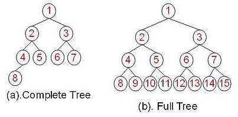
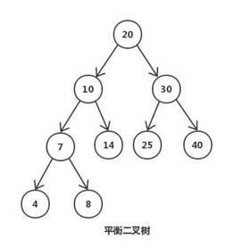
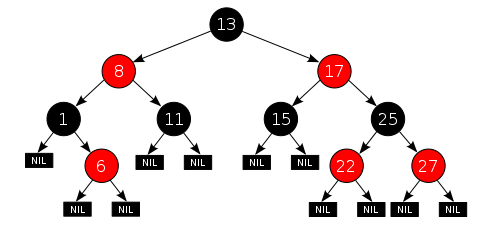
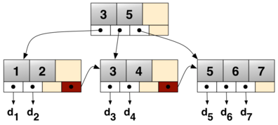

图片未标明出处的均为使用ProcessOn（https://www.processon.com/）作图。

#### 二叉树（Binary Tree）

每个节点（node）最多有两个子树（children）。  ---Wikipedia 二叉树的遍历： 深度优先遍历(depth-first order)、广度优先遍历(Breadth-first order) 前序遍历(pre-order)、中序遍历(in-order)、后序遍历(post-order)  

#### 二叉搜索树（Binary Search Tree）

是一颗二叉树同时有以下性质：

1.  若任意节点的左子树不空，则左子树上所有节点的值均小于它的根节点的值；
2.  若任意节点的右子树不空，则右子树上所有节点的值均大于它的根节点的值；
3.  任意节点的左、右子树也分别为二叉查找树；
4.  没有键值相等的节点。---wikipedia

当插入的数据有序时，查找效率跟顺序查找的效率相当，所以有了平衡树，使得左右子树高度严格平衡（相差0或1）。  

#### 平衡二叉搜索树（Balanced Binary Tree）

平衡二叉搜索树跟二叉搜索树差别在于，当插入、删除数据导致树的高度相差大于1时，会对树进行旋转(rotate)。 平衡二叉树可以保证查找时间，但是删除节点需要检查从删除节点开始到根的路径上所有的平衡因子，因此删除代价较大。  图自百度百科

#### 红黑树（Red-black tree） # 划重点

牺牲了部分平衡性以换取插入/删除操作时少量的旋转操作，整体来说性能要优于AVL树。---wikipedia 删除节点时只需要进行最多3次的旋转。   

1.  节点是红色或黑色。
2.  根是黑色。
3.  所有叶子都是黑色（叶子是NIL节点）。
4.  每个红色节点必须有两个黑色的子节点。（从每个叶子到根的所有路径上不能有两个连续的红色节点。）
5.  从任一节点到其每个叶子的所有[简单路径](https://zh.wikipedia.org/wiki/%E9%81%93%E8%B7%AF_(%E5%9B%BE%E8%AE%BA) "道路 (图论)")都包含相同数目的黑色节点。

\----wikipedia  

#### B树（B-Tree）

一般化的二叉查找树，可以拥有多于2个子节点。  

#### B+树（B+Tree） # 划重点

  

# **插入搜索删除都是重点**